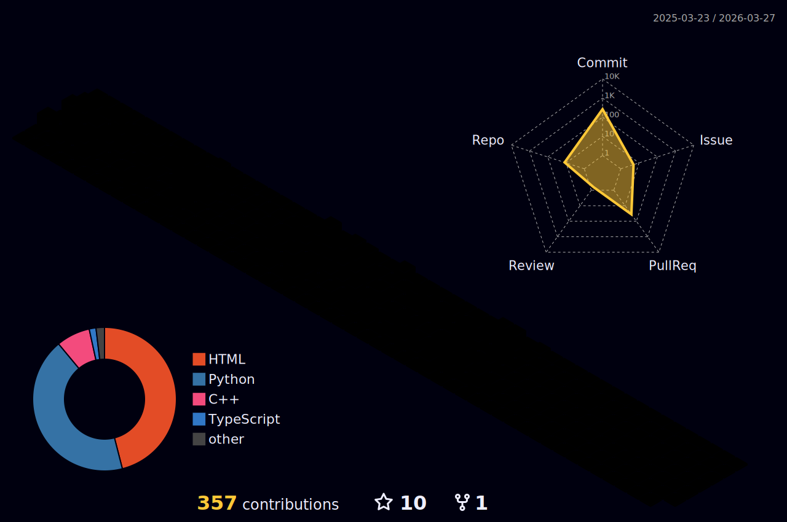

  
   
  <h1 style="margin-left: 20px;">Olá, eu sou o Mateus! <picture>
  <source srcset="https://fonts.gstatic.com/s/e/notoemoji/latest/1f44b/512.webp" type="image/webp">
  
</picture> </h1>

   

   
  

 

## Sobre mim 

 
   

  
   - 🎓 Estudante de *Desenvolvimento de Sistemas* no Serviço Nacional de Aprendizagem Industrial (SENAI)
   
  -  📚 Estudante de *Engenharia da Computação* na Universidade Virtual do Estado de São Paulo (UNIVESP)
   
  -  👨‍💻 Atualmente aprendendo *Python* e *C++*
   
  -  🚀 Explorando novas tecnologias e desenvolvimento de software
  
  

 

## Tecnologias e Ferramentas que estou aprendendo/interessado:

  

  

  

  

## Como entrar em contato comigo

<picture align="center">
  <source media="(prefers-color-scheme: dark)" srcset="https://raw.githubusercontent.com/Matt-ags/Matt-ags/output/github-contribution-grid-snake-dark.svg">
  <source media="(prefers-color-scheme: light)" srcset="https://raw.githubusercontent.com/Matt-ags/Matt-ags/output/github-contribution-grid-snake-dark.svg">
  
</picture>

<picture align="center">
  
  
  
</picture>

