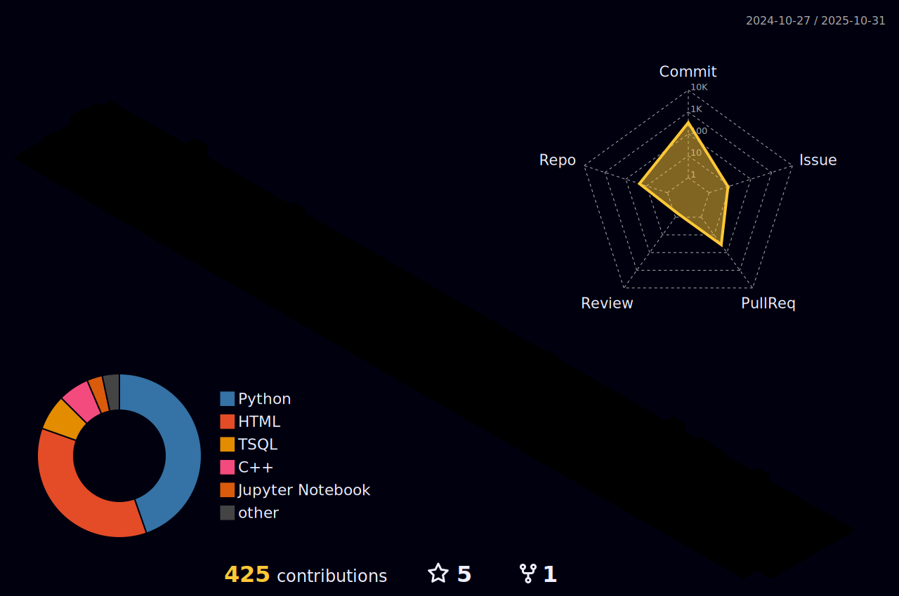

<picture align="center">
  
  
  
</picture>

## Sobre mim 

 
   

  
   - 🎓 Formado como *Técnico em Desenvolvimento de Sistemas* pelo SENAI 
   
  -  📚 Estudante de *Engenharia da Computação* na Universidade Virtual do Estado de São Paulo (UNIVESP)
   
  -  🚀 Interesse em áreas que envolvam **sistemas computacionais aplicados**, automação, hardware e software trabalhando juntos — indo além do código isolado.

  

 

## Tecnologias e Ferramentas que estou aprendendo/interessado:

<table align="center" width="100%">

  <tr align="center">
    <th width="50%"><h3>Ferramentas</h3></th>
    <th width="50%"><h3>Bancos de Dados</h3></th>
  </tr>

  <tr align="center" height="100px">
    <td width="50%">
      
    </td>
    <td width="50%">
      
    </td>
  </tr>

  <tr align="center">
    <th width="50%"><h3>Front-end</h3></th>
    <th width="50%"><h3>Back-end</h3></th>
  </tr>

  <tr align="center" height="100px">
    <td width="50%">
      
    </td>
    <td width="50%">
      
    </td>
  </tr>

  <tr align="center">
    <th width="50%"><h3>Linguagens</h3></th>
    <th width="50%"><h3>Hardware & Sistemas</h3></th>
  </tr>

  <tr align="center" height="100px">
    <td width="50%">
      
    </td>
    <td width="50%">
      
    </td>
  </tr>

</table>

## Como entrar em contato comigo

